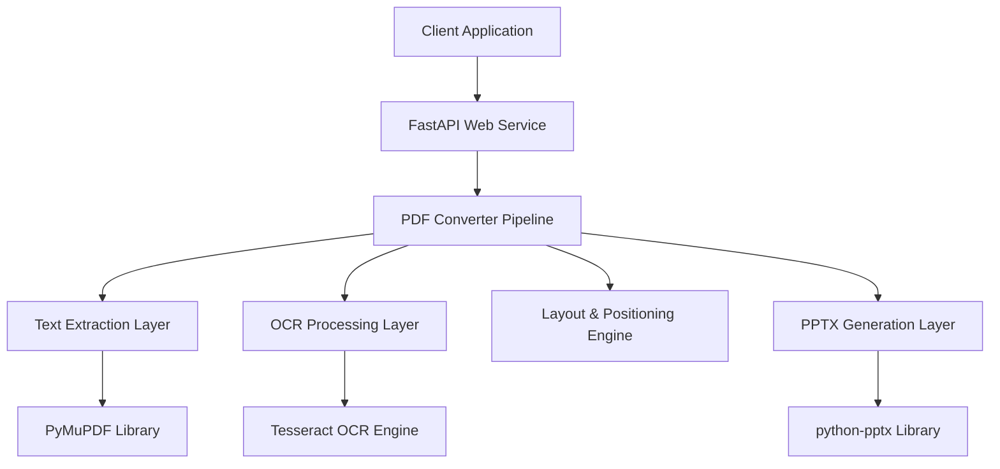

# Design Document

## Overview

The PDF to PPTX converter is a containerized web service built with FastAPI that provides a REST endpoint for converting PDF documents to text-only PowerPoint presentations. The system uses a multi-stage text extraction approach: first attempting native text extraction with PyMuPDF, then falling back to Tesseract OCR for scanned documents. The service maintains 1:1 page-to-slide mapping while preserving text positioning and readability through coordinate scaling and text normalization.

## Architecture

### High-Level Architecture



### Service Architecture

The service follows a layered architecture pattern:

1. **API Layer**: FastAPI handles HTTP requests, file uploads, and response streaming
2. **Conversion Pipeline**: Orchestrates the conversion process from PDF to PPTX
3. **Text Extraction**: Handles both native PDF text extraction and OCR processing
4. **Layout Processing**: Normalizes text and calculates positioning coordinates
5. **PPTX Generation**: Creates PowerPoint slides with positioned text boxes

### Container Architecture

- **Base Image**: Python 3.12-slim for minimal footprint
- **System Dependencies**: Tesseract OCR, OpenGL libraries, Ghostscript
- **Application Structure**: Modular Python package with clear separation of concerns
- **Port Exposure**: Single port 8000 for HTTP traffic

## Components and Interfaces

### API Component (`main.py`)

**Purpose**: Provides REST endpoints for PDF upload and PPTX download

**Key Methods**:
- `GET /`: Returns service usage instructions
- `POST /convert`: Accepts PDF upload, returns PPTX download

**Dependencies**: FastAPI, python-multipart for file uploads

**Error Handling**: 
- 400 for invalid file types
- 500 for conversion failures with detailed error messages

### Conversion Pipeline (`convert.py`)

**Purpose**: Orchestrates the entire PDF to PPTX conversion process

**Key Methods**:
- `pdf_to_pptx(pdf_bytes, ocr_langs, dehyphenate)`: Main conversion function
- `_slide_size_for_ratio()`: Adjusts slide dimensions based on PDF aspect ratio
- `_has_sufficient_text()`: Determines if OCR fallback is needed
- `_extract_blocks_with_pymupdf()`: Extracts native text blocks from PDF

**Processing Flow**:
1. Load PDF document and determine page dimensions
2. Create PowerPoint presentation with optimized slide size
3. For each page: extract text blocks or perform OCR
4. Normalize and group text blocks
5. Create slides with positioned text boxes
6. Return serialized PPTX bytes

### OCR Processing (`ocr.py`)

**Purpose**: Handles Tesseract OCR for scanned or image-heavy pages

**Key Methods**:
- `ocr_page_lines(page, dpi, langs)`: Performs OCR and returns line-level text boxes

**Processing Details**:
- Renders PDF page to PNG at specified DPI (default 300)
- Uses Tesseract with line-level grouping for better readability
- Converts pixel coordinates back to PDF points
- Groups words into lines using Tesseract's block/paragraph/line hierarchy

**Configuration**:
- Language: English (configurable)
- Output level: Line-based grouping
- DPI: 300 for optimal text recognition

### Layout Engine (`layout.py`)

**Purpose**: Normalizes text content and handles coordinate transformations

**Key Methods**:
- `normalize_and_group(blocks, dehyphenate)`: Cleans and organizes text blocks
- `to_pptx_units()`: Converts PDF coordinates to PowerPoint EMU units
- `_dehyphenate()`: Removes end-of-line hyphenation

**Text Processing**:
- Removes end-of-line hyphenation using regex patterns
- Normalizes whitespace while preserving paragraph breaks
- Sorts blocks in reading order (top-to-bottom, left-to-right)
- Applies coordinate scaling with margin padding

**Coordinate System**:
- Input: PDF points (72 points per inch)
- Output: PowerPoint EMU (914,400 EMU per inch)
- Scaling: Linear transformation with aspect ratio preservation
- Margin: 2% padding to prevent text clipping

## Data Models

### Text Block Model

```python
TextBlock = Tuple[float, float, float, float, str]
# (x0, y0, x1, y1, text) in PDF points
```

**Fields**:
- `x0, y0`: Top-left corner coordinates
- `x1, y1`: Bottom-right corner coordinates  
- `text`: Extracted text content

### Page Dimensions Model

```python
PageDimensions = Tuple[float, float]
# (width_pts, height_pts) in PDF points
```

### Slide Configuration Model

```python
SlideConfig = {
    'width_emu': int,    # Slide width in EMU
    'height_emu': int,   # Slide height in EMU
    'margin_factor': float  # Margin as percentage (0.02 = 2%)
}
```

## Error Handling

### Input Validation Errors

- **Invalid File Type**: Return HTTP 400 with message "Please upload a PDF"
- **Empty PDF**: Raise ValueError "Empty PDF" during processing
- **Corrupted PDF**: PyMuPDF will raise exceptions, caught and re-raised as HTTP 500

### Processing Errors

- **OCR Failures**: Gracefully handle by creating blank slides
- **Text Extraction Failures**: Fall back to OCR processing
- **Memory Issues**: Let container limits handle resource constraints
- **Font/Rendering Issues**: Use fallback font sizing algorithms

### Error Response Format

```json
{
    "detail": "Conversion failed: [specific error message]"
}
```

## Testing Strategy

### Unit Testing

**Text Extraction Tests**:
- Test PyMuPDF text extraction with various PDF types
- Test OCR processing with scanned documents
- Test text normalization and dehyphenation functions
- Test coordinate transformation accuracy

**Layout Processing Tests**:
- Test text block grouping and sorting
- Test coordinate scaling with different aspect ratios
- Test margin application and boundary conditions
- Test font size calculation algorithms

**PPTX Generation Tests**:
- Test slide creation with various text layouts
- Test presentation structure and metadata
- Test file serialization and deserialization

### Integration Testing

**End-to-End Conversion Tests**:
- Test complete pipeline with native text PDFs
- Test complete pipeline with scanned PDFs
- Test mixed content PDFs (native + scanned pages)
- Test edge cases: empty pages, large files, complex layouts

**API Testing**:
- Test file upload handling and validation
- Test response streaming and headers
- Test error handling and status codes
- Test concurrent request handling

### Performance Testing

**Throughput Tests**:
- Measure conversion time for various PDF sizes
- Test memory usage during processing
- Test concurrent request handling capacity

**Quality Tests**:
- Verify text extraction accuracy
- Verify layout preservation quality
- Verify OCR accuracy on test documents

### Container Testing

**Docker Build Tests**:
- Verify all dependencies are installed correctly
- Test Tesseract OCR functionality in container
- Test service startup and health checks

**Deployment Tests**:
- Test docker-compose deployment
- Test port exposure and network connectivity
- Test volume mounting if needed for large files

## Performance Considerations

### Memory Management

- Stream file uploads to avoid memory spikes
- Process pages individually to limit memory usage
- Use BytesIO for in-memory PPTX generation
- Clean up temporary objects after processing

### Processing Optimization

- Skip OCR when sufficient native text is available
- Use appropriate DPI settings (300) for OCR balance of quality/speed
- Implement text block caching for repeated processing
- Use efficient coordinate transformation algorithms

### Scalability

- Stateless service design enables horizontal scaling
- Container-based deployment supports orchestration
- Consider adding request queuing for high loads
- Monitor resource usage and implement limits

## Security Considerations

### Input Validation

- Strict file type checking (PDF only)
- File size limits to prevent DoS attacks
- Content validation to detect malicious PDFs
- Sanitize extracted text content

### Container Security

- Use minimal base image (Python slim)
- Run as non-root user in container
- Limit container resources (memory, CPU)
- Regular security updates for dependencies

### Data Handling

- No persistent storage of uploaded files
- Process files in memory when possible
- Clear sensitive data after processing
- Implement request timeouts